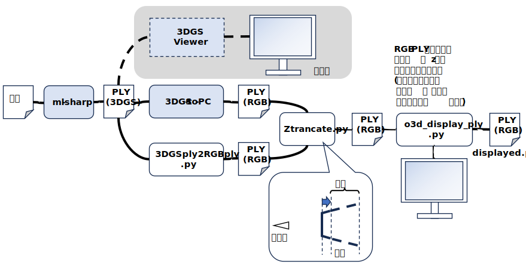
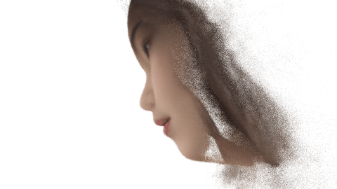
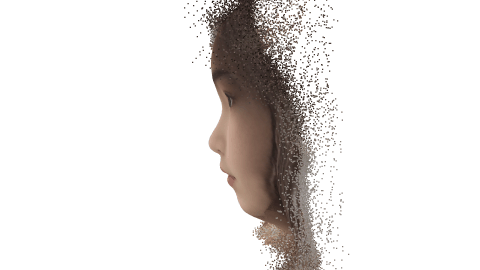
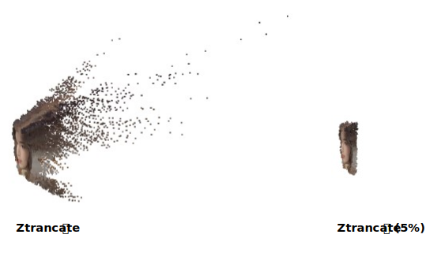

<html lang="ja">
    <head>
        <meta charset="utf-8" />
    </head>
    <body>
<h1>
「ml-sharp」をちょっと試してみる
</h1>
<h2>なにものか？</h2>

<a href="https://github.com/apple/ml-sharp">apple の「ml-sharp」</a> をちょっと試したら
3DGS(Gaussian Splatting)のPLYファイルができたけど, 持っている GPU では 3D Gaussian Splatting のレンダリング出来ず･･･  
 
3DGS PLY → RGB PLY に変換して表示させてみた。(本来の使い方ではないけど･･･)

<a href="https://github.com/Lewis-Stuart-11/3DGS-to-PC">3DGS-to-PC</a> で3DGS PLYをPoint Clpodに変換した場合 (z値を2倍にした) 

 
Gaussian Splatting の 直流成分?(f_dc_*) をテキトーに変換して簡易的に RGB PLY に変換した場合 (z値を2倍にした) 

 

※ 3DGS-to-PC を使った方が点群の数が多いけど, ぱっと見, あまり変わらず･･･ 
　 3DGS-to-PC を使った方は、260MB超のPLYファイルになる。 
　 簡易変換版は約55MB (z値切り落とし後は約30MB)。

<h3>STEP1: ml-sharp で画像から 3DGS PLY を作る</h3>

　・<a href="https://github.com/apple/ml-sharp">apple の「ml-sharp」</a> Code → Download ZIP 
　・ml-sharp_main.zip を解凍する。 
　・conda create -n (仮想環境名) python=3.11 
　　※ python 3.10 だと後の pip install がエラー終了する。 
　・conda activate (仮想環境名) 
　・pip install -r requirements.txt 
　・sharp infer -i (画像を格納したフォルダ) -o (出力フォルダ) 

<h3>STEP2: 3DGS PLY を RGB PLY に変換する</h3>
<h4>2-1： 3DGS-to-PC で Gaussian Splatting を Point Clound に変換する</h4>
※ 簡易変換でいくなら 2-1 はスキップ 

　・<a href="https://github.com/Lewis-Stuart-11/3DGS-to-PC">3DGS-to-PC</a> で Code → Download ZIP 
　・3DGS-to-PC-main.zip 解凍 
　・conda activate (仮想環境名) 
　・pip install configargparse 
　・pip install opencv-python 
　・pip install open3d 
 
　・ml-sharp の出力する PLY には 「f_rest_＊」プロパティは無かったので 
　「gauss_dataloader.py」の以下の行をコメントアウト 
 
　　　extra_f_names = [p.name for p in plydata.elements[0].properties if p.name.startswith("f_rest_")] 
　　　extra_f_names = sorted(extra_f_names, key = lambda x: int(x.split('_')[-1])) 
 
　　　assert len(extra_f_names)==3*(max_sh_degree + 1) ** 2 - 3 
　　　features_extra = np.zeros((xyz.shape[0], len(extra_f_names))) 
　　　for idx, attr_name in enumerate(extra_f_names): 
    　　　features_extra[:, idx] = np.asarray(plydata.elements[0][attr_name]) 
 
　「gauss_dataloader.py」の以下の行を変更 
 
　　　features_extra = features_extra.reshape((features_extra.shape[0], 3, (max_sh_degree + 1) ** 2 - 1)) 
　　　　↓ 
　　　features_extra = features_extra.shape[0] 
 
　・GPU が使えない場合は 「device="cpu"」に変更。 
　　「camera_handler.py」,「gauss_dataloader.py」,「gauss_handler.py」,「gauss_to_pc.py」, 「mesh_handler.py」 
 
　・python gauss_to_pc.py --input_path (ml-sharp が出力したPLYファイル) --no_render_colours  
　　「3dgs_pc.ply」に RGB PLY が出力される。  

<h4>2-2： 簡易変換で 3DGS PLY を RGB PLY に変換する</h4>
※ 3DGS-to-PC で RGB PLY に変換する場合は, 2-2はスキップ。 
 
　python 3DGSply2RGBply.py (ml-sharp が出力したPLYファイル) 
　「***__3dgs2rgb.ply」に RGB PLY が出力される。

<h3>STEP3: Z値の大きい点群を削除する</h3>

　Z値の大きい点群が不要な場合は削除する 
　python Ztrancate.py (RGB PLYファイル) [(パーセント)] 

<h3>STEP4: RGB PLY を表示する</h3>

　python o3d_display_ply.py (RGB PLYファイル) [(z値スケール)] 
　・凹凸を強調したい場合は, z値スケールに 1 より大きい値を指定する。 
　・凹凸を弱めたい場合は, z値スケールに1未満の値を指定する。 
　 
　・マウスドラッグ：モデルの回転 
　・ホイールボタンを押しながらマウスドラッグ：モデルの平行移動 
　・1/2/3 キー：モデルの回転, Shift+1･2･3：反対方向に回転 
　・4/5/6キー：モデルの平行移動, Shift＋4/5/6：反対方向に平行移動 
 
　・「-」キー, 「^」キー：点群の大きさを変更 
　　※ 3DGS-to-PC で変換した RGB PLYファイルを表示する場合は、点群を小さくした方が良いと思う。 
　・「@」キー「[」キー：表示画角の変更 
　・「p」キー：スクリーンショット 
　・「ESC]キー：終了 
 
　「dhisplayed.ply」にz値スケールされた RGB PLYが出力されます。

</body>
</html>
